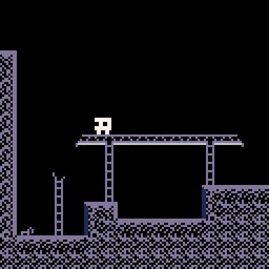

# Pico-polo

My Pico indie game recreated in the [Pico-8](https://www.lexaloffle.com/pico-8.php) Virtual Console platform.

## About Pico-8
PICO-8 is a fantasy console for making, sharing and playing tiny games and other computer programs. It feels like a regular console, but runs on Windows / Mac / Linux. When you turn it on, the machine greets you with a commandline, a suite of cartridge creation tools, and an online cartridge browser called SPLORE.

## Limitations
PICO-8 games, as well as the program's interface itself, are limited to a 128x128 pixel, 16-color display, and a 4-channel audio output.
